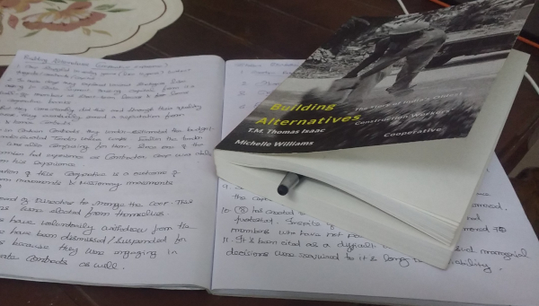

Title: Reading Building Alternatives - Introduction
Date: 2019-02-10
Category: Alternatives
Tags: books, alternatives, economy, cooperatives
Slug: building-alternatives-intro
Author: Prasanna Venkadesh

**Uralungal Labour Contract Cooperative Soceity (ULCCS)** is almost **90 year old** (as of this writing in 2019) **cooperative of construction workers** from the state of Kerala, India. 

The current finance minister of Kerala, Dr. T.M. Thomas Issac (CPIM) and Dr. Michelle Williams (Professor at University of Witswatersrand, South Africa) had come together to tell us the story of this cooperative in a book titled, **Building Alternatives - The story of India's Oldest Construction Workers' Cooperative**.

This book was published by LeftWord publishers and has a very good preface from the chief-editor of LeftWord, Mr. Vijay Prasad titled, **Possible Communism** which can also be [read here](https://indianculturalforum.in/2018/01/03/possible-communism/).

When this book was advertised through the social media accounts of LeftWord publishing house and May Day bookstore, I was so excited to get a copy of this book as I along with few more comrades were also pondering about the question of **What alternatives to capitalist mode of production are possible today?**

I along with my comrades went to attend a **International Conference on "Cooperatives in The Changing World of Work"** organized at Indian Institute of Management - Kozhikode, Kerala by various organizations including **International Cooperative Alliance - Asia Pacific**, **International Labour Organization**, **Kerala Startup Mission**, **[ULCCS](http://ulccsltd.com/)**, **[ULTS](http://ults.in/)**, **[Nilenso](https://nilenso.com)**, etc. 

We were very glad, each received a copy of this book as participants of this conference and the cooperative hackathon (Coopathon) that took place.

I have had debates and discussions with other people over the idea of worker-owned cooperatives (i.e workers owning and self-managing their companies instead being a employee working for wage/salary) and ULCCS is such a living example today. It is worth mentioning that, today ULCCS has built and owns an **Information Technology Park** at Kerala and it has also given birth to **Uralungal Labour Technology Solutions (ULTS)** which is a IT firm.

Similarly it is also important to mention, **[Nilenso](https://nilenso.com)** based out of Bengaluru is also India's first worker-owned software cooperative.

Since I started reading the book, I have highlighted and took note of points which I felt are important take aways from ULCCS' experience of successfully driving a cooperative for 9 decades. Hence, I would like to also consolidate those key take-aways as a series of blog post.
