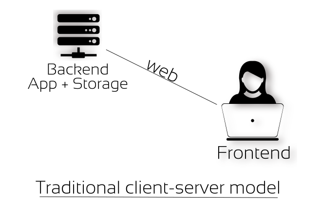
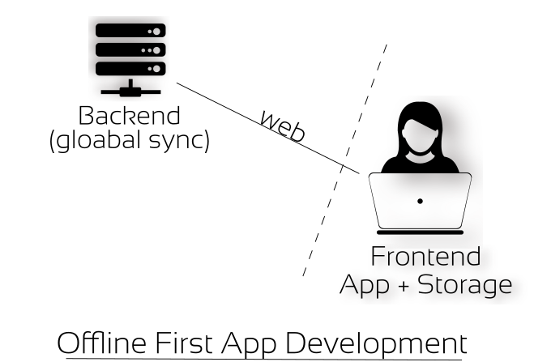

Title: Learnings From Building Offline First Web App
Date: 2017-04-24
Category: Programming
Tags: code, Internet, tech, web, free software
Slug: offline-first-coops-map
Author: Prasanna Venkadesh

I wrote a web app recently. The purpose of the web app is to map the **cooperatives** around us. I'll speak about the intentions behind it in another post, for now let us focus on the **Offline First**
approach of this app. The application is hosted here [live](https://prashere.gitlab.io/coop-demo).

### Initial Version

This is how I implemented it initially. Since it is a web application, users are going to access the app using web browser, therefore frontend is necessary. Similarly users are also going to mark/add new
coops to the map and this has to be stored somewhere. So taking a traditional web app approach, I have decided to write a backend in python which would receive data entered by users in frontend, process
them and store them in a database (preferred sqlite).

Frontend (client)
-------
- html (defines the structure)
- css (for defining styles)
- js (handle user events like placing marker in the map and making XHR requests to talk with the backend server to store and retrieve data).

Backend (server)
-------
- flask (a python based micro web framework)
- sqlite3 (for storing and retreiving data)

**So what does this traditional design mean?**

The frontend depends on the availability of the backend to work. Without backend part the frontend part becomes useless. This is true for all traditional client/server web application and
this also means **centralization** and therefore **Single Point of Failure (SPoF)**. In case, if the data is lost at the server side either accidentally or intentionally, the data is lost forever and
all those user contributions are gone. poof. This is why we call them **SPoF**. [Here](https://gitlab.com/fshm/coops-map/) is the source of the initial implementation in `flask` + `sqlite3` + `frontend`.

------------

I strongly believe in distributed, decentralized and peer-to-peer design practice, because these design practices empowers users and participants instead of the one who hosts it, for users and participants
are those who create values for themselves, while the one who hosts the application and data treats users as commodities and also appropriates the value created by users for their profit.
This is nothing short of labor theft. It's a classical problem inherent to capitalism and it's predecessors. i.e **Who creates value and Who enjoys the fruits of the labour?**

Provoked by this thought, I have been experimenting, studying and using various p2p and decentalized designs in whatever I come across. Therefore, it is natural for me to look for an alternative model
of this application. That is when I came across principles like **[Offline First](http://offlinefirst.org/)**, **[noBackend](http://nobackend.org/)** and **[unHosted](http://unhosted.org/)**.

The moment I started to explore them is like... (I am falling short of words here to express), because of the movement world-wide and there are people with similar thoughts have demonstrated the same.

### Offline First Version

Offline First, noBackend and unHosted are all design principles. While digging deeper into these design principles a lot of Free Software and Open Source hacktivists were already developing frameworks and
libraries based on these principles. Among those, **[hoodie](hood.ie)**, **[kinto](https://www.kinto-storage.org/)** and **[remoteStorage](https://remotestorage.io/)** are worth mentioning. I started with
`hoodie` but since it is not well documented at the moment, I found it difficult to put it to use and then I jumped into `remoteStorage` and then eventually  settled with `kinto` by **Mozilla** since it is
very well documented right from the beginning.

The [live](https://prashere.gitlab.io/coop-demo) version that you saw above is actually the offline first version written with the help of `kinto`. This is how it the offline-first version is organized.

Frontend
--------
- html (defines the structure)
- css (defines styles)
- js (handles user events & XHR)
- IndexedDB (a key, value JSON like data store within browser itself, which means data can be stored & retrieved on user's devices itself, Whoa!).

Backend
------
- kinto-server (server side storage)

At this point you might be wondering, when data can be stored and retreived locally without backend or server, why did we store data at server side too. This is to allow synchronization of data to various
devices as well as to various users globally over the Internet. It depends on what your app tries to achieve. In our case, we need a site that is accessible over web where anyone can visit and take a look
at the coops marked already or can contribute by adding new coops.

The point here is that there is no single point of failure. Due to offline first approach, the data is stored on user devices. Even if the backend goes off or the data is lost at server side, users still
have the data with them. This data independence also open news possibilities like allowing users to choose their backend servers or go completely offline. [Here](https://gitlab.com/prashere/coops-map-offline-first) 
is the source of the offline first implementation. When you look at it, it is a static web application with just html, css and js.

If you are interested with this approach, do explore the above design principles, libraries, frameworks as well as in-browser features like **[Service Workers](https://developer.mozilla.org/en-US/docs/Web/API/Service_Worker_API/Using_Service_Workers)** 
and **[IndexedDB](https://developer.mozilla.org/en-US/docs/Web/API/IndexedDB_API/Using_IndexedDB)**. [This documentation](https://developer.mozilla.org/en-US/Apps/Fundamentals/Offline) from mozilla developer networks explains the offline workflow.
