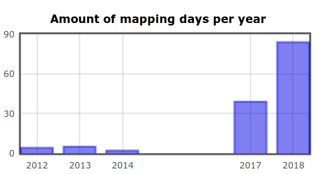
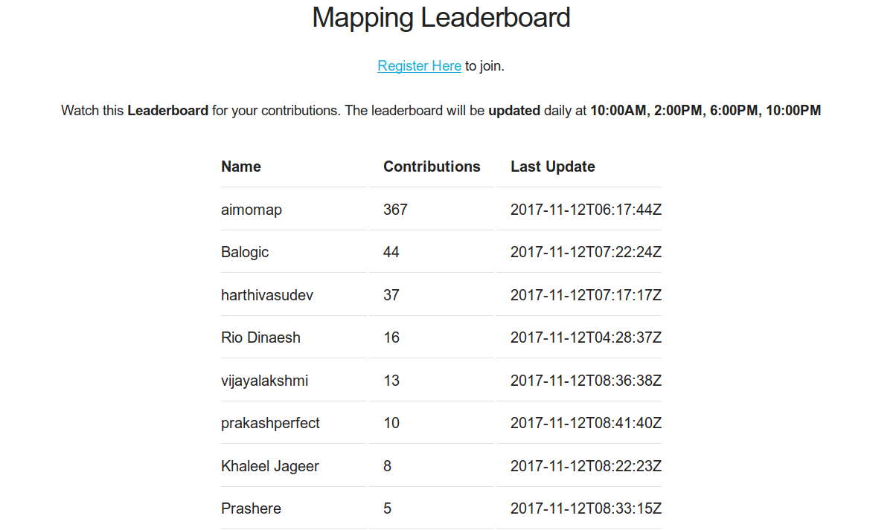

Title: Contributions to OpenStreetMap
Date: 2018-10-06
Category: Mapping
Tags: osm, mapping
Slug: osm-contributions
Author: Prasanna Venkadesh

I wrote this post to document my contributions to OpenStreetMap and to enrich the ecosystem.

[OpenStreetMap](https://openstreetmap.org) (OSM) is the map built by the people, for the people and of the people. In other words, it is the democratic process of creating the map of the earth together. Simultaneously anyone can also download all the geographical inforamtion from OpenStreetMap and use it for their own purposes. If Wikipedia is the encyclopedia commons, then OSM is the commons for geographical data.

I joined OpenStreetMap by the end of 2011 but made my first drawing in OSM only by the mid of 2012. You can see my participation [here](https://hdyc.neis-one.org/?Prashere). There is a graph titled **Amount of mapping days per year** in that link, if you observe that graph you can find that it was only in 2017 I took a serious participation in contributing to OSM. I did not even care about contributing to OSM during 2015 & 2016.

When I joined OSM, I was carried away by the idea of Open Source and the Linux ecosystem. I don't know anything about the licenses or GNU project or Free Software itself. Over the years I was exposed to the idea of Free Software, it's principles and philosophy. This is where everything started to change. It took 4 years for me to understand the idea of knowledge commons (or) digital commons. By the end of 2017, at [FSFTN](https://fsftn.org) we organized a OSM mapathon for celebrating [#osmgeoweek](http://osmgeoweek.org/). This is when my contribution to OSM also got serious. That is why in the above graph, there is a rise in my contribution during the period of 2017-18.

As a part of the week long mapathon, I built a [web based leaderboard software in python](https://gitlab.com/prashere/osm-leaderbooard/) that will rank the participants based on the number of edits they made during that period. Nearly 50 participants from Pondicherry and Tamilnadu took part in this mapathon and the [top 10 contributors were honoured by FSFTN](https://www.facebook.com/media/set/?set=a.1902578996436104&type=1&l=375930f529) for their contribution to the commons.

I released this [leaderboard software](https://gitlab.com/prashere/osm-leaderbooard/) under a Free Software license, so that anyone around the world could make use of this software to run a local mapathon in their place. Sooner, [Swecha](https://swecha.org), a sister organization of FSFTN from Andhra Pradesh and Telengana forked the leaderboard program and started to remix for their purpose. The forked version can be found [here](https://code.swecha.org/sripathroy/osm-leaderboard). It was moments like these that motivates people like me to write program and release them under FOSS license. The gratification that I receive when I create a socially necessary or useful program for myself and others is all that matters.

By early 2018, some of us at Pondicherry got interested into [Platform Cooperativism](http://www.rosalux-nyc.org/platform-cooperativism-2/) by **Trebor Scholz**, especially building an open and alternative platform for Uber and Ola. This means not depending on google maps or any proprietary maps as well. Obviously without doubt, our choice would be to use OSM (in fact Uber relies on OSM data for routing I suppose). We wanted to prototype it and for that we chose a OpenGL based android library called [VTM](https://github.com/mapsforge/vtm) Vector Tile Maps for rendering the map. We took the map raw data from OSM and converted into Mapsforge Binary format using a tool called Osmosis and for routing we used a android library called graphhopper. The raw data from OSM would be in XML format and this needs to be converted into respective formats for both rendering and routing. I came up with a [shell script](https://gitlab.com/coopon/uauto/backend/map-preparation) that can automate all this process of downloading the raw data from OSM and converting them into respective formats.

But the application that we are attempting to build itself is far from complete.

<iframe width="560" height="315" src="https://www.youtube-nocookie.com/embed/tm-it-6-h68?rel=0" frameborder="0" allow="autoplay; encrypted-media" allowfullscreen></iframe>

Beyond these I took 2 sessions on getting started with OpenStreetMap and drawing roads, buildings and point of interests at a local meetup organized by FSHM Puducherry. One of the session is recorded and uploaded to youtube.

So far my contributions to OSM include **mapping**, **osm-leaderboard**, **map preparation process** and **tutorial**.
