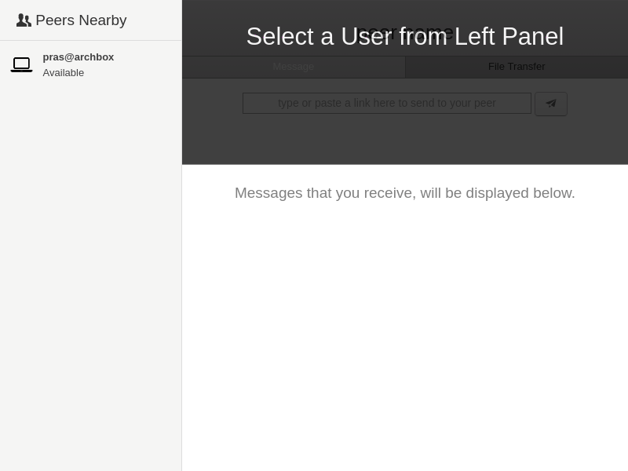

Title: P2P File & URL Sharing App on LAN
Date: 2016-07-08
Category: Programming
Tags: code, free software, networks, tech
Slug: working-on-p2p-file-url-sharing-app
Author: Prasanna Venkadesh

For the past 1 week, I have been working on a peer-to-peer File and URL sharing app and I have named it as **Transceiver** (the ability to transmit and receive data). I would like to log the progress of what I have done so far.

There are various reasons, why I am writing this application.

1. I wanted to try and learn how to build cross platform Desktop applications using [electron](http://electron.atom.io/).
2. I wanted to write a p2p application, since I have been exploring p2p and mesh networking quite often.
3. Last thing, I needed this application.

Whenever I attend meetups and I wanted to share some URLs that I have bookmarked to others, we do this by using some service that runs on Internet. It could be IRC or any Instant Messengers. Sometimes we have even tried using Pidgin + Bonjour (Avahi for GNU/Linux) and that have worked well too. But we have never succeeded file transfer through Pidgin + Bonjour.

Following is a GIF of what have been done so far.

</img>

First thing, it doesn't make sense to send URL links or Files or any data through Internet to a person who is sitting next to me or in the same hall, connected to the same network. The data doesn't need to leave the network in first place and also you don't need to expose to all those centralized services out there.

Second thing, even in such a WLAN (or) LAN, there should be no central server / single point of failure. People should be able to form ad-hoc networks and should be able to communicate. In this sense, this application is serverless and peer-to-peer such that it doesn't need any central server (or) signalling server (like how they have in torrent trackers or webRTC peer connection) to connect to each other.

Third thing, it has to be a Free Software. There already exists few of them like D-LAN (Distributed File Sharing on LAN), Lan Messenger, etc., I am just stacking up mine to the list.

I use,

1. [Zeroconf](http://www.zeroconf.org/) (also known as Bonjour or Avahi in GNU/Linux) for automatically registering and discovering peers on the same network.
2. [Socket.io](http://socket.io/) for end to end socket connection. (I could still make use of socketio to upgrade the connection to webRTC).
3. Electron + nodejs as a cross-platform framework.

An instance of this application can act as both server and client at the same time, thus can listen for incoming data and also it can send data to other peers on the network. Since the peers are discovered through zeroconf, their identities are exposed to everyone on the network using this app and thus we are able to eliminate central signalling server here.

For now the text / URL sharing is complete. I am yet to work on the File transfer part. I am releasing this work under Free Software license (GPL v3) and the source code is hosted on [gitlab here](https://gitlab.com/prashere/transceiver/).
